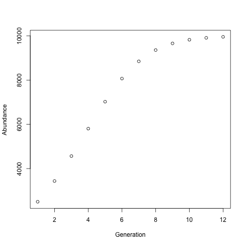

# Discrete-time Logistic Growth Function in R
This is the Lab 08 for EBIO5420 Computational Biology course. The lab instruction is here. [Lab08 instruction](https://github.com/flaxmans/CompBio_on_git/blob/master/Labs/Lab08/Lab08_documentation_and_metadata.md)

## What is discrete-time logistic growth model?
Logistic population growth occurs when the growth rate decreases as the population reaches carrying capacity. The model of logistic growth in continuous time follows from the assumption that each individual reproduces at a rate that decreases as a linear function of the population size. [Reference](http://www.zoology.ubc.ca/~bio301/Bio301/Lectures/Lecture5/Overheads.html)

Here is the discrete-time logistic growth equation, used in many models of population abundance over time:
n[t] = n[t-1] + ( r * n[t-1] * (K - n[t-1])/K )
where n[t] is the abundance of the population at time t, n[t – 1] is the abundance of the population in the previous time step, r is the intrinsic growth rate of the population, and K is the environmental carrying capacity for the population. [Lab04](https://github.com/flaxmans/CompBio_on_git/blob/master/Labs/Lab04/Lab04_ForLoops.md)

## Discrete-time Logistic Growth Function in R
1. Function input: You need to input `r` (the intrinsic growth rate), `K` (the carrying capacity), and the initial population size `a` as its arguments.
2. How the function works:
```
growthModel <- function(r,K,a) { #Turn the logistic growth model code into a function
    Abundance <<- rep(0,12) #Creat a vector to store abundance data
    Abundance[1] <<- a # Set the initial population size
    Generation <<- seq (1,12) # Creat a vector to store time spots
    for (i in 2:12) { #Use loop to calculate population sizes
        Abundance[i] <<- Abundance[i-1] + (r * Abundance[i-1] * (K - Abundance[i-1])/K)
    }
    Data <<- data.frame(Generation, Abundance)
    (Data) <<- c("generations","abundance")
    png(filename="growthModelPlot.png") # Save the plot
    plot(Generation, Abundance) # Plot data
    dev.off()
    return(Data)
}

growthModel(0.5,10000,2500) # test function
write.csv(Data,file="growthModelData.csv") # Wirite data to a file
```
3. Function output:
* We will have a variable called 'Data' that have generation and abundance data
* We will also save a plot of generation and abundance in the current working directory

4. Example: input `r`=0.5, `K`=10000, `a`=2500, and display the plot here


